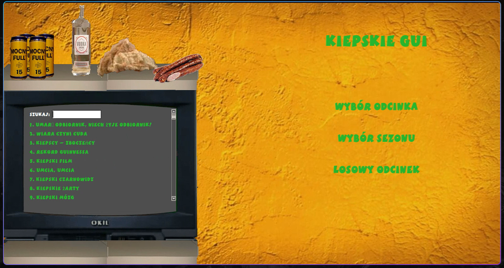

# Kiepski TV

A trashy Świat według Kiepskich player with embedded VLC and custom UI.



## Requires Internet Connection (episodes are stored online)

## Features

- Embedded VLC video playback
- Fullscreen toggle with overlay controls
- Episode list with live search
- Custom font and styling
- Keybinds for volume, seek, fullscreen
- Scrollable episode list inside TV

## Requirements

- Python 3
- `python-vlc`
- `Pillow`

## Install attached font for best experience

## Usage

1. Put your `links.txt` in the folder
2. Run:

```bash
python kiepscy-gui.py

